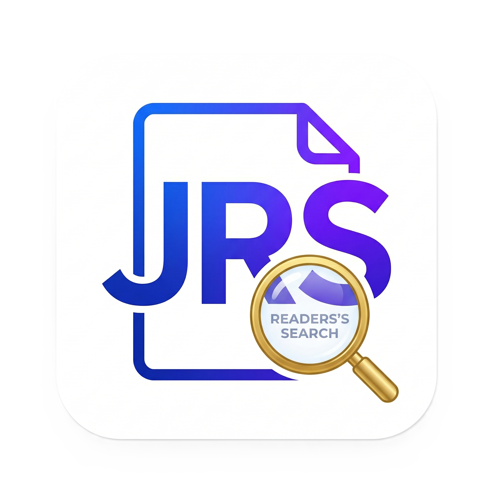

# Leitor PDF

<p align="center">
  
</p>

<p align="center">
  <strong>Um leitor de PDF simples, bonito e direto ao ponto.</strong>
</p>

<p align="center">
  
  
  
  
  
</p>

---

## Sobre o projeto

Eu fiz esse projeto porque odeio profundamente o estado atual de muitos aplicativos de PDF no celular.

Você quer abrir um PDF qualquer, uma conta, um boleto, um contrato, uma apostila, um comprovante, e o aplicativo resolve transformar isso em:

- propaganda na tela inteira
- banner embaixo
- pedido de assinatura
- bloqueio de recurso básico
- enrolação para simplesmente abrir um arquivo

Isso é um completo absurdo.

O **Leitor PDF** nasceu com uma ideia muito simples:  
**abrir PDF do celular com rapidez, sem poluição visual e sem tratar leitura básica como produto premium.**

---

## Destaques

- Abertura de PDF direto do armazenamento do celular
- Lista de arquivos recentes
- Navegação por páginas
- Ir para uma página específica
- Zoom por gesto
- Rolagem vertical e horizontal
- Indicador de página atual e total de páginas
- Tema claro e escuro
- Paletas de cor personalizáveis
- Estrutura organizada em português

---

## Visual e proposta

Este projeto foi pensado para ser:

- leve
- limpo
- rápido
- agradável de usar
- fácil de evoluir

Nada de interface carregada sem necessidade.  
Nada de fluxo confuso para abrir um arquivo.  
Nada de propaganda para ler um PDF que já é seu.

---

## Estrutura do projeto

```text
lib/
  blocos/
    tema_aplicativo/
  controladores/
  modelos/
  paginas/
    inicio/
    configuracoes/
    visualizador_pdf/
  temas/
  aplicativo.dart
  main.dart
```

### Organização

- `blocos/tema_aplicativo`: estado global de tema e paleta
- `controladores`: regras locais da aplicação, como leitura e recentes
- `modelos`: modelos de dados
- `paginas`: telas e componentes visuais
- `temas`: paletas e fábrica de tema

---

## Tecnologias usadas

- Flutter
- Dart
- `flutter_bloc`
- `shared_preferences`
- `file_picker`
- `syncfusion_flutter_pdfviewer`

---

## Como executar

```bash
flutter pub get
flutter run
```

Para validar o projeto:

```bash
dart format lib test
flutter analyze
```

---

## Status

Projeto funcional e em evolução.

Próximas ideias possíveis:

- favoritos
- busca de texto no PDF
- histórico mais completo
- marcador de última página lida
- organização por pastas

---

## Motivação pessoal

Esse projeto é quase um protesto em forma de aplicativo.

Ler PDF no celular deveria ser uma tarefa banal.  
Mas transformaram isso em mais uma oportunidade de empurrar anúncio, limitar função básica e atrapalhar o usuário.

Então a proposta aqui é clara:

> **se o arquivo é seu, abrir e ler deveria ser simples.**

---

## Licença

Este projeto pode ser adaptado conforme a necessidade do repositório.
